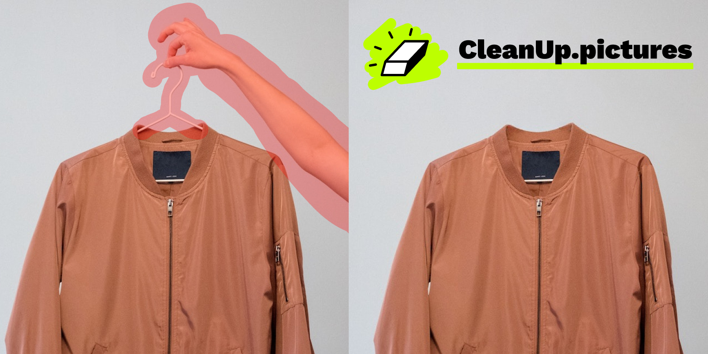

# [CleanUp.pictures](https://cleanup.pictures)

This is the code repository for [CleanUp.pictures](https://cleanup.pictures), a free web application that lets you quickly cleanup or remove objects in any image.

[CleanUp.pictures](https://cleanup.pictures) consists in 3 main blocks:

- A frontend built with [React](https://reactjs.org/) / [Typescript](https://www.typescriptlang.org/) / [TailwindCSS](https://tailwindcss.com/)
- A Nodejs Firebase function to proxy the fetch requests on a secure HTTPS endpoint with [AppCheck/reCAPTCHA v3](https://firebase.google.com/docs/app-check)
- An inpainting service running [LaMa](https://github.com/saic-mdal/lama) on GPU via [Cloud Run for Anthos](https://cloud.google.com/anthos/run)

## Setup

1. Function: `cd functions && npm i`
2. Frontend: `yarn`

Then edit the [.env](.env) file to match your firebase & backend settings.

## Development

1. Function: `cd functions && npm run serve`
2. Frontend: `yarn dev`

## Deployment

1. Function: `firebase deploy --only functions`
2. Frontend: `yarn build && firebase deploy --only hosting`

## Acknowledgements

CleanUp.pictures wouldn't be possible without [LaMa: Resolution-robust Large Mask Inpainting with Fourier Convolutions](https://github.com/saic-mdal/lama) by Samsung Research.
