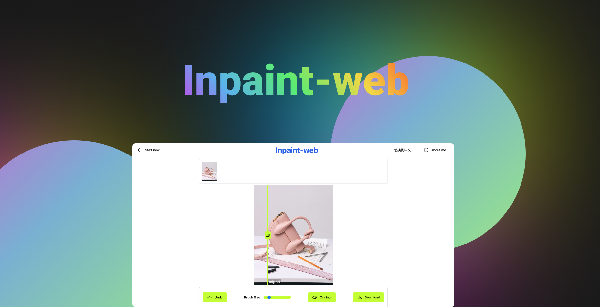

  
# Inpaint-web

A free and open-source inpainting & image-upscaling tool powered by webgpu and wasm on the browser.

基于 Webgpu 技术和 wasm 技术的免费开源 inpainting & image-upscaling 工具, 纯浏览器端实现。

## Inpaint（图片修复）

https://github.com/lxfater/inpaint-web/assets/22794120/bcad4812-02ae-48bb-9e84-94dfeb7234f5

## Super-Resolution（图片高清化）

https://github.com/lxfater/inpaint-web/assets/22794120/3a8d894f-9749-4685-b947-8b5f15c9cf38

## Demo link

Demo link:https://inpaintweb.lxfater.com/

## Project Roadmap

### en

- [x] Image Modification History
- [x] Optimize Model
- [x] Integrate Post-Processing into the Model
- [x] Image-upscaling
- [ ] Integrate Segment Anything for Quick Selection and Removal in Images
- [ ] Integrate Stable Diffusion for Image Replacement
- [ ] Better UI

### cn

- [x] 图像修改历史
- [x] 优化模型
- [x] 后处理集成于模型中
- [x] 超分辨率
- [ ] 接入 Segment Anything，实现快速选择和去除图像
- [ ] 接入 stable diffusion，实现图像替换
- [ ] 更好的界面

## Setup

`npm install`

## Development

`npm run start`

## Contributors

## Translations via [fink editor](https://inlang.com/m/tdozzpar/app-inlang-editor)

## About me

### Wechat

    

### English Content

For updates and discussions in English, follow me on Twitter:

### 中文内容

获取中文更新和讨论，请关注我的 Twitter:

## Acknowledgements

Frontend code are modified from [cleanup.pictures](https://github.com/initml/cleanup.pictures), You can experience their
great online services [here](https://cleanup.pictures/).

Model: https://github.com/Picsart-AI-Research/MI-GAN

## Star History

